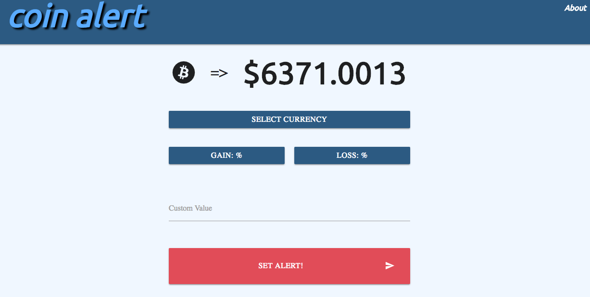

# **CoinAlert**

CoinAlert utilizes the CoinDesk API to track the price of bitcoin across three currencies
(USD, EUR, GBP) and alert the user when certain parameters are met.

## **Getting Started**

Click [here](https://build-cdidooojrx.now.sh) to visit the site and check out whats happening
with bitcoin!

## **Tech Used**

React.js
React-Materialize
React-Alerts
Now

## **Author**

- Matthew Hyrka
- mhyrka@gmail.com
- linkedin.com/in/mhyrka

### **License**

MIT

